# NET4103_Projet

## 2. 
Le plus petit réseau (Caltech) a 762 nœuds dans la plus grande composante connectée (LCC), et le plus grand a plus de 40000 nœuds dans la LCC.,Utilisons trois réseaux du FB100 : Caltech (avec 762 nœuds dans la LCC), MIT (qui a 6402 nœuds dans la LCC), et Johns Hopkins (qui a 5157 nœuds dans la LCC).

### (a) Degree Distributions

#### Caltech (avec 762 nœuds dans la LCC)
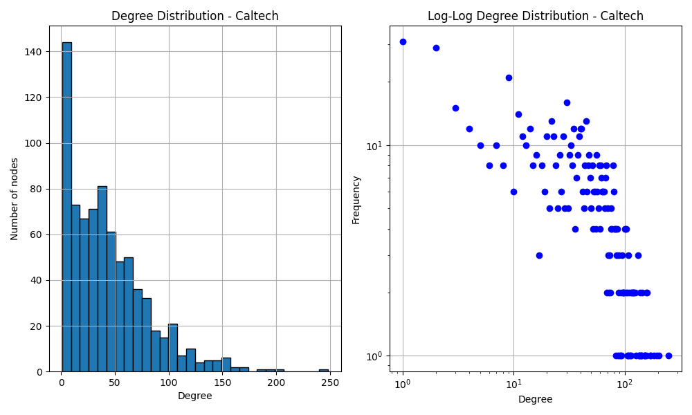

#### MIT(qui a 6402 nœuds dans la LCC)
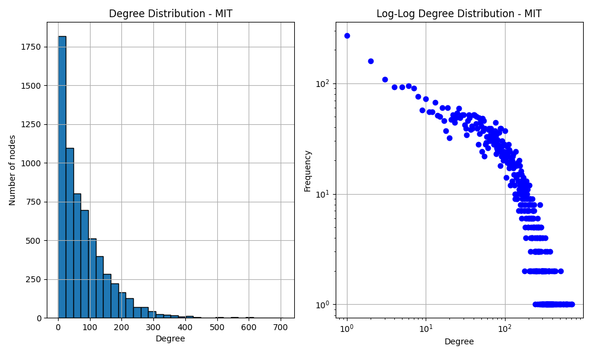

#### Johns Hopkins (qui a 5157 nœuds dans la LCC)
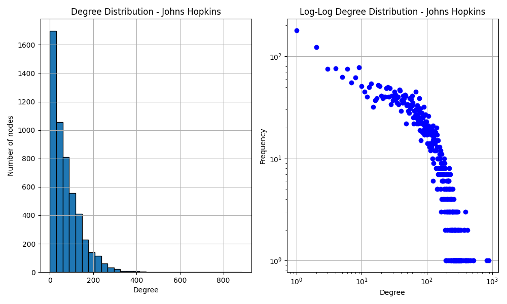

> What are you able to conclude from these
degree distributions?

### (b) Coefficients de clustering et densité

Nous avons calculé les métriques suivantes pour chaque réseau (LCC uniquement) :

| Université       | Global Clustering | Mean Local Clustering | Densité des Arêtes |
|------------------|-------------------|------------------------|--------------------|
| Caltech          | 0.2913            | 0.4091                 | 0.057429           |
| MIT              | 0.1803            | 0.2724                 | 0.012261           |
| Johns Hopkins    | 0.1932            | 0.2690                 | 0.014034           |

#### Interprétation

> L'un ou l'autre de ces réseaux doit-il être considéré comme peu dense ? Sur la base des informations relatives à la densité et au regroupement, que pouvez-vous dire de la topologie du graphe ?

Oui, tous ces réseaux sont peu denses, particulièrement MIT et Johns Hopkins (densité ≈ 1–2%).

Clustering global/local mesure la tendance des voisins d’un sommet à aussi être voisins entre eux, donc la présence de triangles (groupes d'amis mutuels).

Caltech a les meilleurs scores de clustering :
- Global Clustering : 0.2913 (assez élevé)
- Mean Local Clustering : 0.4091

➔ Cela suggère que Caltech a une structure fortement communautaire : des petits groupes très connectés, même si globalement le réseau reste peu dense.

MIT et Johns Hopkins ont un clustering plus bas :
- Environ 0.18–0.19 global, et 0.27 en local.

➔ Cela indique des structures plus "diffuses" : il y a des liens, mais moins de triangles fermés, donc moins de petits groupes très soudés.

### (c) diagramme de dispersion

(1 point) Pour chaque réseau, dessinez également un diagramme de dispersion du degré en fonction du coefficient de regroupement local. Sur la base de ces calculs et des précédents, êtes-vous en mesure de tirer des conclusions sur les similitudes ou les différences entre les réseaux d'arbres ? Quelles autres observations pouvez-vous faire ?

#### Caltech (avec 762 nœuds dans la LCC)
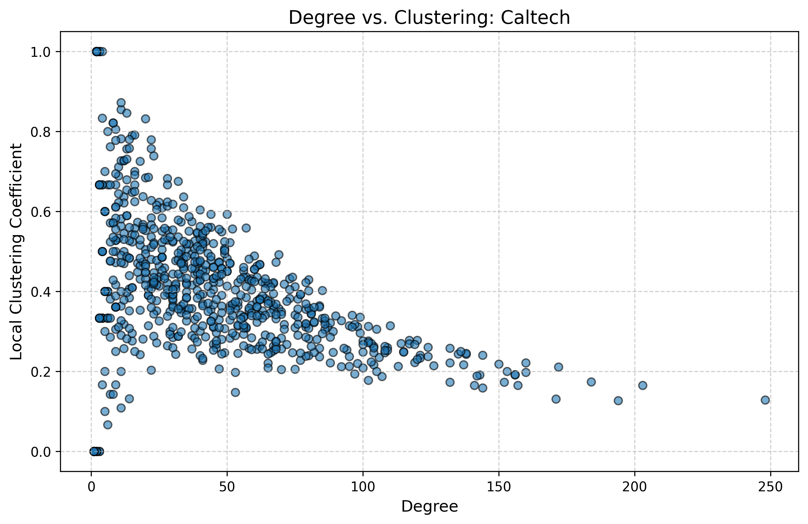

#### MIT(qui a 6402 nœuds dans la LCC)
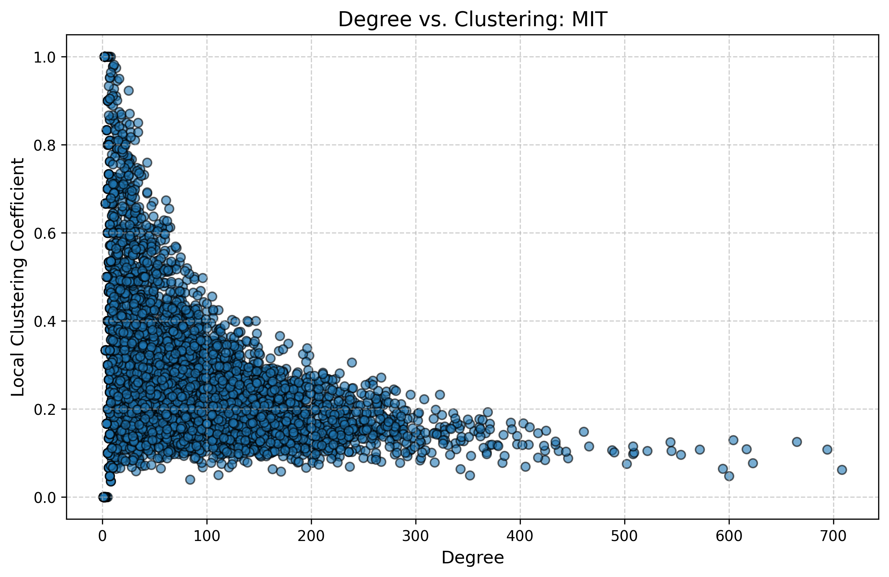

#### Johns Hopkins (qui a 5157 nœuds dans la LCC)
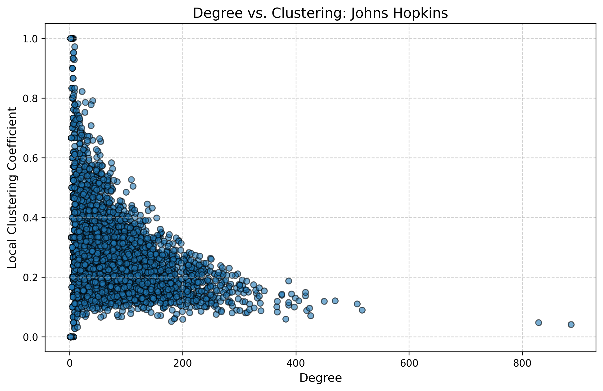

#### **1. Les réseaux sont-ils clairsemés (sparse) ? Que peut-on dire de leur topologie ?**  

✅ **Tous les réseaux sont extrêmement clairsemés** :  
- **Densité** très faible (Caltech : 0.057, MIT : 0.012, Johns Hopkins : 0.014), ce qui est typique des grands réseaux réels (ex : Facebook a une densité ~10⁻⁶).  
- **Preuve de parcimonie** : La densité diminue avec la taille du réseau (MIT/JHU plus grands → densité plus faible).  

#### **Caractéristiques topologiques**  
| Métrique               | Caltech       | MIT           | Johns Hopkins |  
|------------------------|---------------|---------------|---------------|  
| **Densité**            | 0.057         | 0.012         | 0.014         |  
| **Degré moyen**        | 43.7          | 78.5          | 72.4          |  
| **Clustering local**   | 0.409         | 0.272         | 0.269         |  
| **Clustering global**  | 0.291         | 0.180         | 0.193         |  

- **Propriété "petit monde"** (small-world) :  
  - **Clustering élevé** (≫ réseaux aléatoires) + **chemins courts** (typique des réseaux sociaux).  
  - Caltech est le plus marqué (clustering le plus fort).  
- **Tendance "scale-free"** :  
  - Distribution des degrés probablement en loi de puissance (quelques hubs, beaucoup de nœuds peu connectés).  
  - MIT/JHU ont des degrés moyens plus élevés → plus de hubs.  

**Implications** :  
- La **faible densité** permet une structure économe en liens.  
- Le **clustering élevé** favorise la diffusion d’information dans des communautés soudées.  

---

#### **2. Comparaison des réseaux et observations**  

#### **Similitudes**  
- **Propriétés universelles** :  
  - Tous sont **clairsemés**, **petits mondes**, et montrent une **corrélation négative** entre degré et clustering.  
  - Architecture typique des réseaux sociaux réels.  

#### **Différences clés**  
| Aspect                | Caltech              | MIT                  | Johns Hopkins        |  
|-----------------------|----------------------|----------------------|----------------------|  
| **Structure communautaire** | Plus forte (clustering élevé) | Plus faible (liens "ponts") | Intermédiaire |  
| **Centralisation**    | Moins hiérarchique   | Plus de hubs         | Hubs modérés         |  
| **Taille**           | Petit (762 nœuds)    | Grand (6402 nœuds)   | Moyen (5157 nœuds)   |  

#### **Observations notables**  
- **Anomalie de Caltech** :  
  - Densité plus élevée que MIT/JHU malgré sa petite taille → **sociabilité très concentrée** (ex : campus petit, interactions fréquentes).  
- **MIT vs. Johns Hopkins** :  
  - MIT a un **degré moyen plus élevé** mais un **clustering plus faible** → réseautage plus large (ex : cours massifs, collaborations interdisciplinaires).  
  - Johns Hopkins est un compromis entre Caltech et MIT.  

#### **Questions complémentaires**  
- La distribution des degrés suit-elle une **loi de puissance** ? (Vérifier les plots log-log.)  
- Les hubs jouent-ils un rôle de **ponts** entre communautés ? (Analyser la centralité intermédiaire.)  

## 3. Analyse de l’assortativité sur les réseaux Facebook100

Nous avons analysé l’assortativité sur 100 réseaux sociaux issus du jeu de données **Facebook100**. L’étude a été menée pour les 5 attributs suivants :

1. **Statut étudiant/enseignant (`student_fac`)**
2. **Genre (`gender`)**
3. **Majeure (`major_index`)**
4. **Dortoir (`dorm`)**
5. **Degré du sommet (`degree`)**

Chaque attribut a été examiné selon deux types de visualisations :

- **Un diagramme de dispersion (scatter plot)** : montre l’assortativité en fonction de la taille du réseau (avec un axe logarithmique pour le nombre de nœuds), avec une ligne horizontale :
  - **Rouge** : niveau d’assortativité nulle (`0`)

- **Une courbe de densité (histogramme lissé)** : montre la distribution des valeurs d’assortativité pour les 100 réseaux, avec deux lignes verticales :
  - **Rouge** : niveau d’assortativité nulle (`0`)
  - **Bleue** : valeur moyenne de l’assortativité pour l’attribut

### 1. Statut étudiant/enseignant (`student_fac`)

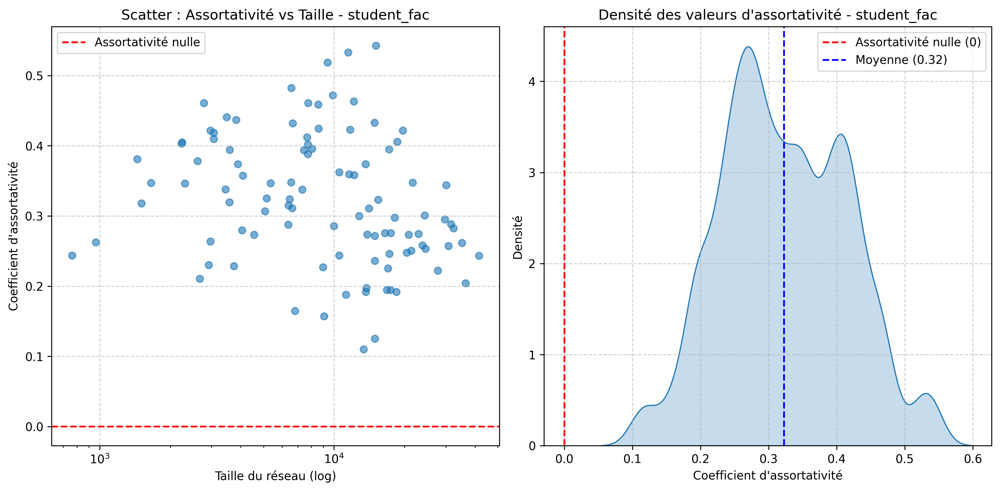

- **Assortativité moyenne** : `0.3227`
- L’assortativité est relativement élevée, indiquant une forte tendance des individus à se connecter avec d'autres du même statut (étudiants entre eux, enseignants entre eux). Cela suggère que les interactions sociales dans les universités sont majoritairement homogènes selon le statut institutionnel.
- La distribution est concentrée au-dessus de zéro, ce qui montre une homogénéité constante à travers les universités.

---

### 2. Genre (`gender`)

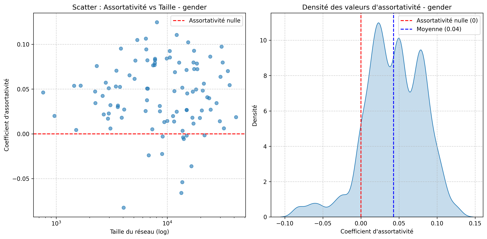

- **Assortativité moyenne** : `0.0429`
- L’assortativité est très faible en moyenne, proche de zéro. Certaines universités présentent même une **assortativité légèrement négative**, jusqu’à -0.10, ce qui signifie que dans ces cas, les connexions sont légèrement plus fréquentes entre genres différents que similaires.
- La densité maximale atteint environ 11, avec une forte concentration autour de 0, et une pointe de densité à 4.8 pour une assortativité nulle. Cela suggère que, dans la majorité des cas, **le genre n’est pas un facteur structurant fort** dans les relations sociales étudiées.

---

### 3. Majeure (`major_index`)

- **Assortativité moyenne** : `0.0511`
- Faible mais toujours positive, ce qui indique une légère tendance à se connecter avec des personnes de la même filière académique.
- L’histogramme est très concentré autour de 0.042, avec une densité atteignant jusqu’à 35, indiquant une forte homogénéité dans la distribution.
- La taille du réseau n’a pas d’effet clair sur l’assortativité, bien que les réseaux les plus grands montrent parfois des valeurs plus élevées, absentes chez les plus petits réseaux. Cela pourrait refléter des structures académiques plus différenciées dans les grandes universités.

---

### 4. Dortoir (`dorm`)

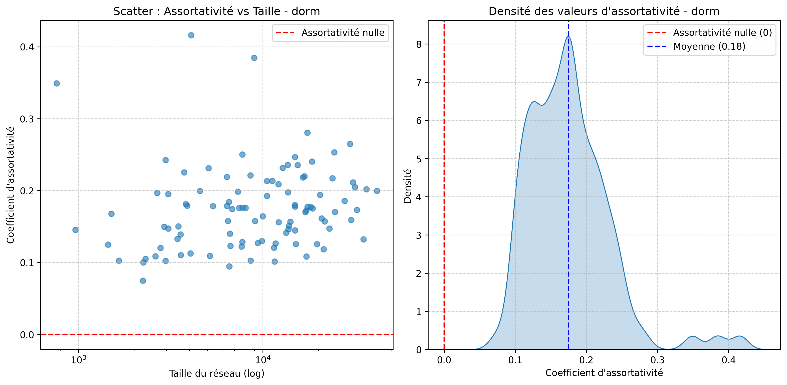

- **Assortativité moyenne** : `0.1751`
- L’assortativité est modérée et toujours strictement positive, indiquant que les personnes ont tendance à se connecter davantage avec celles de leur propre dortoir.
- La densité maximale est d’environ 8, avec une forte densité entre 0.1 et 0.25.
- L’assortativité est relativement stable quel que soit la taille du réseau, suggérant que le lieu de résidence est un **facteur cohérent d’organisation sociale** dans les campus.

---

### 5. Degré du sommet (`degree`)

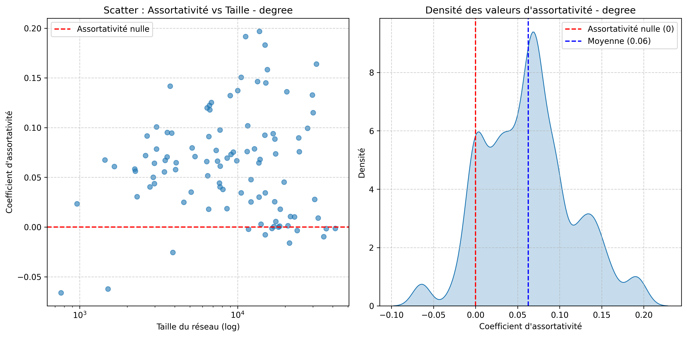

- **Assortativité moyenne** : `0.0626`
- Faible en moyenne, mais la distribution est **très étalée**, avec des valeurs allant jusqu’à **0.2** et descendant à **-0.1**.
- La densité maximale est d’environ 9, avec une densité de 6 autour d’une assortativité nulle.
- **Les petits réseaux** présentent parfois des assortativités négatives, tandis que les **grands réseaux** montrent une plus grande dispersion des valeurs. Cela indique que dans les grandes universités, les profils de connexion sont plus variés en termes de degré ( certains utilisateurs très connectés interagissent avec des utilisateurs peu connectés, et vice-versa) . Ce qui est logique avec le fait que dans une petite université, les étudiants ont plus de chances de se connaître mutuellement, ce qui peut mener à un nombre de connexions similaire entre pairs et donc une assortativité plus homogène. 

## 4. LinkPrediction

### (b) 
Voir sol_Q4.py où l'on trouve:

- class CommonNeighbors(LinkPrediction):
- class Jaccard(LinkPrediction):
- class AdamicAdar(LinkPrediction):

#### (d) **(2 points)** Choisissez quelques graphes du dataset Facebook100, exécutez et évaluez les performances de chaque prédicteur de lien, puis **concluez sur l’efficacité** des trois métriques suivantes :  
- voisins communs,  
- Jaccard,  
- Adamic/Adar.
 On a annalyser les 12 graphes suivants:
- Princeton12.gml,
- Caltech36.gml,
- Oberlin44.gml,
- Johns Hopkins55.gml,
- Lehigh96.gml,
- Bowdoin47.gml,
- Mich67.gml, 
- Tufts18.gml, 
- Hamilton46.gml, 
- Vassar85.gml, 
- Vermont70.gml,  
- Rice31.gml,

 Pour des k différents avec une fractions de 0.5
 J'ai stocké les valeurs obtenue dans un fichier csv: Q4_prediction.csv et j'ai annalysé les donné dan sle programme python analyse_Q4_predi_ction.py .

Pour synthétiser et annalyser les résultats de ces 12 graphes:
Voici un tableau récapitulatifs des scores moyens pour chaques prédicteurs:
         Predictor  Precision    Recall
       AdamicAdar   0.468417  0.017650
  CommonNeighbors   0.463250  0.017317
          Jaccard   0.342867  0.015033

On observe que c'est Jaccard le moins performent de très loin.
On observe... annalyse moi ça de maniére synthétique clair simple

et des ecart-types:

         Predictor  Precision    Recall
       AdamicAdar   0.147414  0.020578
  CommonNeighbors   0.152562  0.020393
          Jaccard   0.099534  0.017450

pareil.

 Voici un diagramme moutache qui annalyse la précision: 
 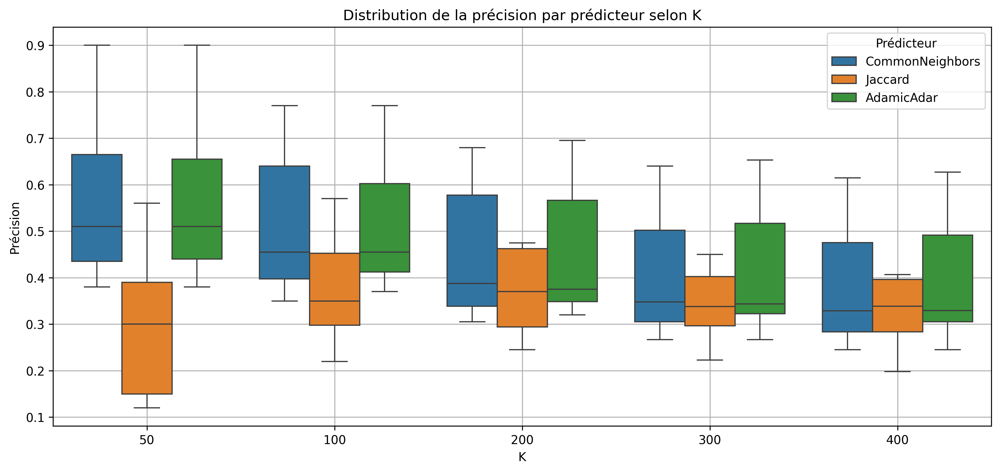

On observe que Common Neighbors et Adamic-Adar sont très proches en termes de performance et assez stables pour tout les K.Jaccard a des performances nettement inférieures, surtout pour K faible (où la précision est cruciale).

> Cela confirme que Jaccard est un moins bon prédicteur.

Les boîtes (IQR) de CommonNeighbors et AdamicAdar sont plus larges pour K faibles, ce qui indique une plus grande variabilité. À mesure que K augmente, les prédicteurs semblent se stabiliser autour d’une précision plus faible, mais plus homogène. Surtout Jaccard qui est bien plus stable mais pour de moins résultat que les deux autre prédicteurs.

> Cela suggère que pour K élevé, les prédicteurs deviennent plus prévisibles, mais moins efficaces.

 Voici le diagramme moutache qui annalyse du recall: 
 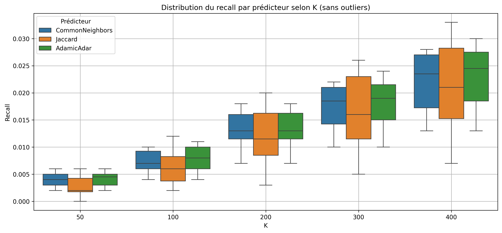

 On obserse ici que les boites sont vraiment toute petite pour k faible et augmente en taille avec la valeur de K.
 On voit en général que jaccard à des boites plus grandes que Common Neighbors ou Adamicar. Les valeurs sont plus répartie pour lui.
 Toute les valeurs moyenne augement vec le K celle de Jaccard et toujours plus petite que ces deux voisins.

Et Voici une annalyse de la densité du recall : 
 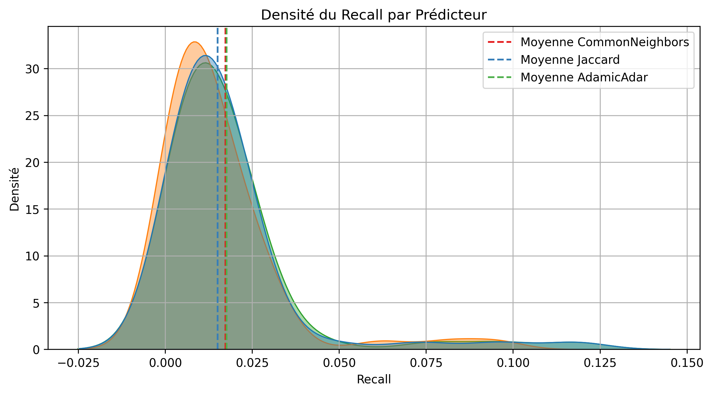

Ici pour la sensité du recall pour les trois prédicteirs ils ont à peux prés la même forme avec une densité un peu plus haute pour 
la densité du 
  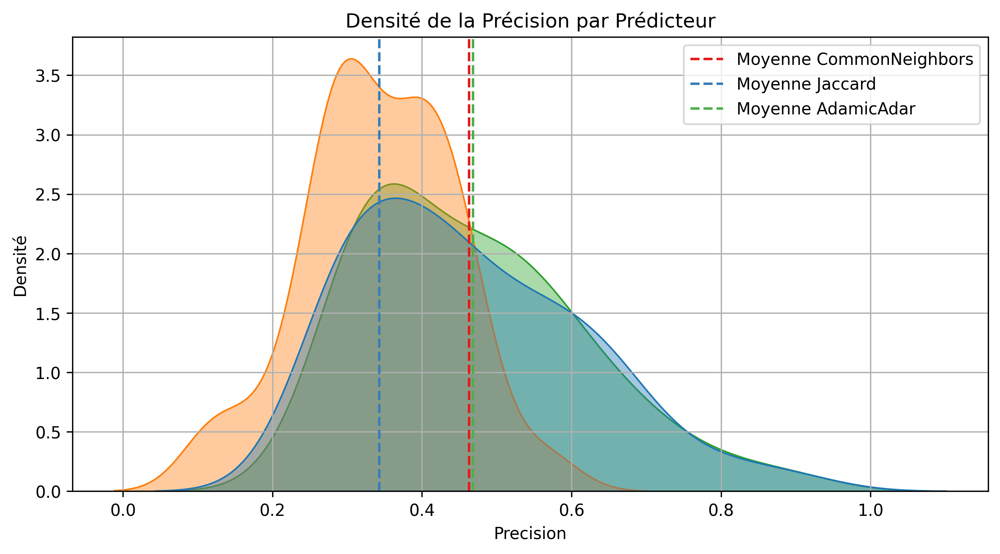

  on voit ici pour jaccar une desité bien plus haute et très différente de celle des deux autre prédicteurs avec unes moyenne bien plus basse du recall et le recall fini à une valeur de 0.7 alors que pour les deux autres : cela va jusqu'à 1.2 !

## 5.

Pour un petit graphe Caltech à seulement 768 noeuds:

| Fraction enlevée | Dorm  | Major | Gender |
| ---------------- | ----- | ----- | ------ |
| 0.10             | 0.347 | 0.262 | 0.425  |
| 0.20             | 0.325 | 0.267 | 0.435  |
| 0.30             | 0.334 | 0.261 | 0.429  |

**Tableau 1 : Accuracy de l’algorithme de Label Propagation**

| Fraction enlevée | Dorm  | Major | Gender |
| ---------------- | ----- | ----- | ------ |
| 0.10             | 14.99 | 14.34 | 0.578  |
| 0.20             | 15.12 | 14.47 | 0.576  |
| 0.30             | 15.11 | 14.31 | 0.579  |

**Tableau 2 : MAE (Mean Absolute Error) du Label Propagation**

1. **Gender** :

   * Donne les meilleurs résultats parmi les trois attributs.
   * L'accuracy reste relativement stable (entre 0.425 et 0.435), même quand on augmente la proportion de données manquantes.
   * L'erreur MAE est très faible (proche de 0.57), ce qui indique que les classes sont bien préservées même en cas de données absentes.

2. **Dorm** :

   * Affiche une précision plus élevée que "major", mais moins bonne que "gender".
   * L'accuracy chute légèrement de 0.347 à 0.325 puis se stabilise à 0.334, ce qui peut indiquer que certaines structures communautaires du graphe aident à la prédiction.
   * L’erreur MAE est plus élevée (≈15), ce qui suggère qu’il y a beaucoup de classes ou que les classes sont déséquilibrées.

3. **Major** :

   * C’est l’attribut le plus difficile à prédire. L’accuracy est faible (\~0.26) et très peu influencée par le taux de données manquantes.
   * Cela suggère que cet attribut est moins corrélé à la structure du graphe (moins homophilique).

Le label propagation est plus efficace pour prédire les attributs fortement **corrélés à la structure du graphe**, comme le **genre**, souvent associé à des clusters clairs (e.g., fraternités/sororités, groupes d’intérêt). En revanche, des attributs comme la spécialisation universitaire (**major**) semblent moins bien structurés dans le graphe, d'où les résultats plus faibles.

Nous pouvons annalyser ce graphe aussi pour un grand nombre de graphes: 
- Princeton12.gml,
- Caltech36.gml,
- Oberlin44.gml,
- Johns Hopkins55.gml,
- Lehigh96.gml,
- Bowdoin47.gml,
- Mich67.gml, 
- Tufts18.gml, 
- Hamilton46.gml, 
- Vassar85.gml, 
- Vermont70.gml,  
- Rice31.gml,

## 6.