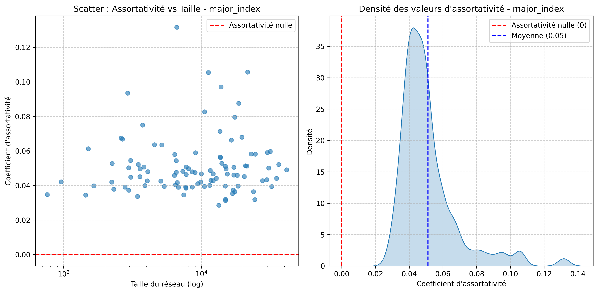
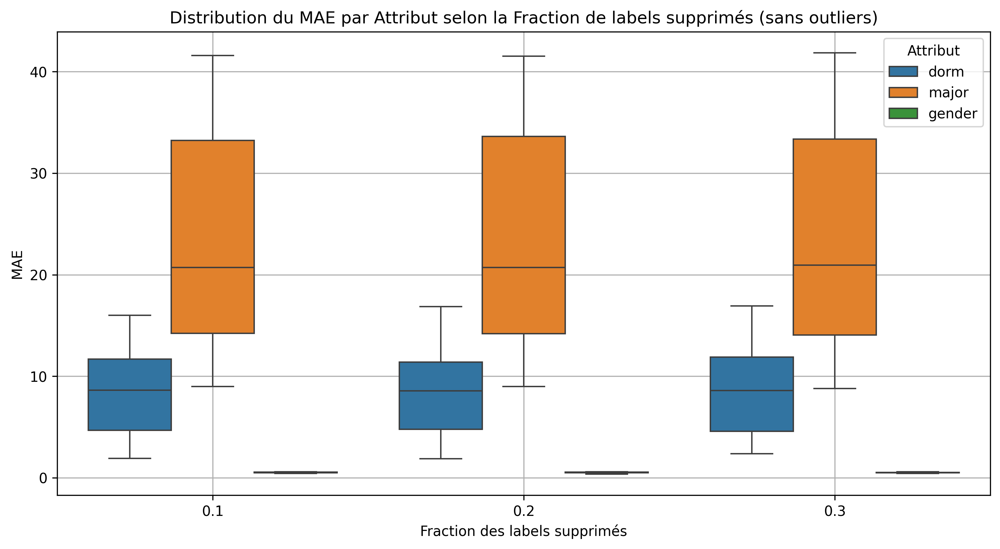
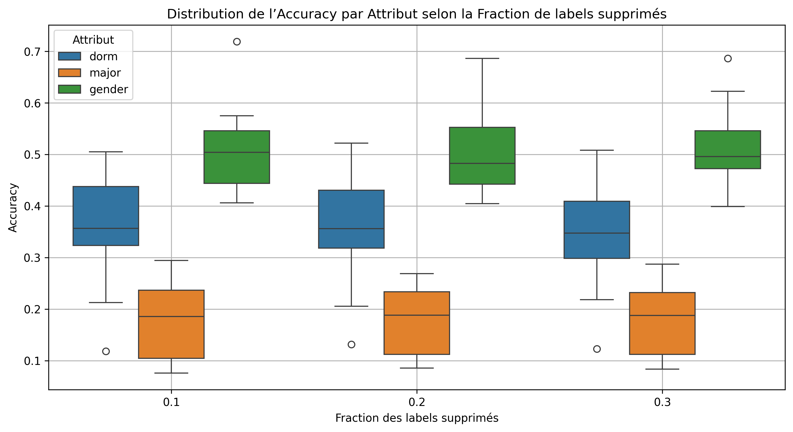
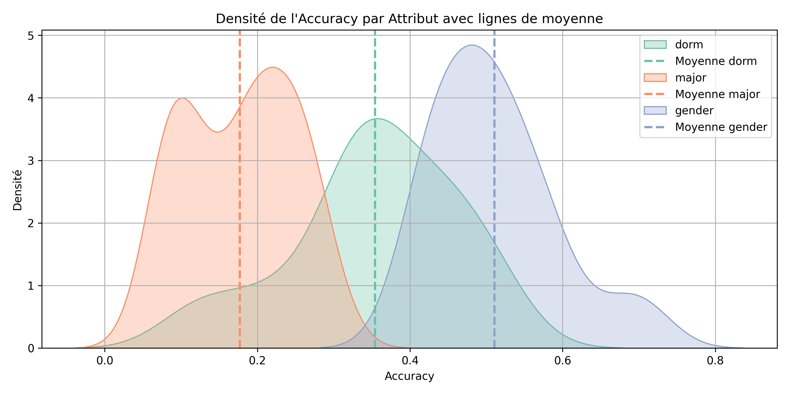
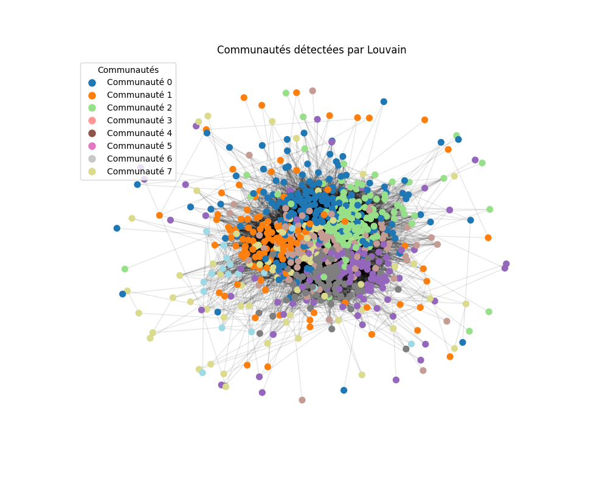
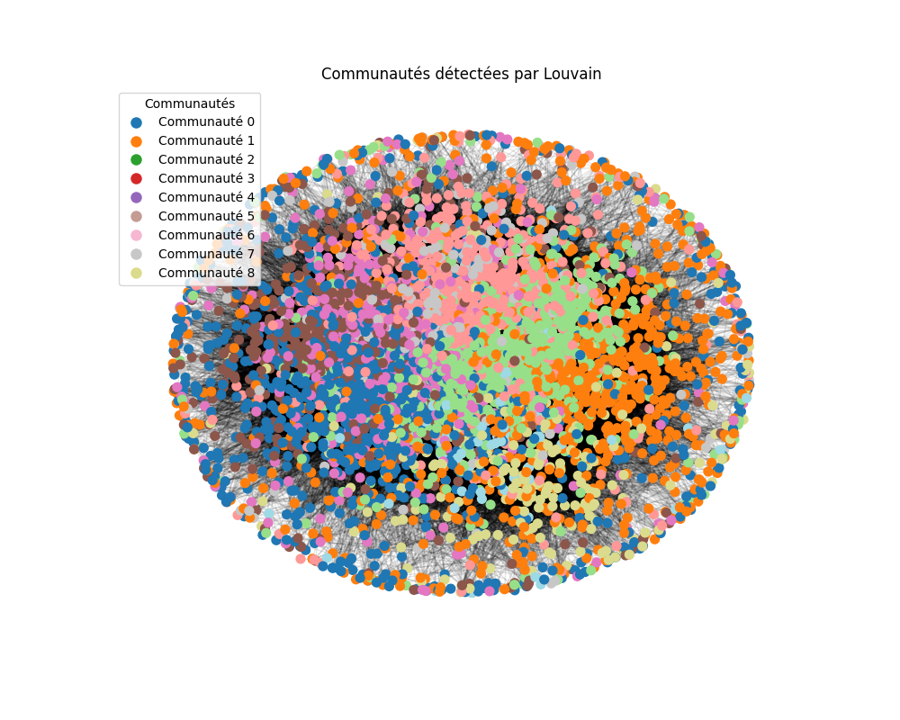

# NET4103_Projet

## 2. 
Le plus petit réseau (Caltech) a 762 nœuds dans la plus grande composante connectée (LCC), et le plus grand a plus de 40000 nœuds dans la LCC.,Utilisons trois réseaux du FB100 : Caltech (avec 762 nœuds dans la LCC), MIT (qui a 6402 nœuds dans la LCC), et Johns Hopkins (qui a 5157 nœuds dans la LCC).

### (a) Degree Distributions

#### Caltech (avec 762 nœuds dans la LCC)

#### MIT(qui a 6402 nœuds dans la LCC)

#### Johns Hopkins (qui a 5157 nœuds dans la LCC)

* On voit pour Caltech que la distribution décroît plus lentement que pour les deux autre graphes, cela indique qu’un petit nombre de nœuds ont un nombre très élevé de connexions — ce sont des **hubs**.

* **MIT et John Hopkins** montrent une distribution plus serrée, ce qui montre une communauté plus **dense et homogène**.
* **MIT (6402 nœuds)** montrent une plus grande dispersion avec des **super-connecteurs** (étudiants très populaires).

> Certains campus ont des structures plus hiérarchiques ou centralisées (avec des hubs), d'autres sont plus égalitaires.
> **Petits réseaux = densité plus forte possible** : Dans  Caltech, les gens sont plus susceptibles d’être connectés entre eux.
> **Grand réseau = plus de variation** : Des hubs émergent, les différences de degré deviennent plus marquées. DAns MIT on voit très bien ce détachement.

### (b) Coefficients de clustering et densité

Nous avons calculé les métriques suivantes pour chaque réseau (LCC uniquement) :

| Université       | Global Clustering | Mean Local Clustering | Densité des Arêtes |
|------------------|-------------------|------------------------|--------------------|
| Caltech          | 0.2913            | 0.4091                 | 0.057429           |
| MIT              | 0.1803            | 0.2724                 | 0.012261           |
| Johns Hopkins    | 0.1932            | 0.2690                 | 0.014034           |

#### Interprétation

> Oui, tous ces réseaux sont peu denses, particulièrement MIT et Johns Hopkins (densité ≈ 1–2%). 

Clustering global/local mesure la tendance des voisins d’un sommet à aussi être voisins entre eux, donc la présence de triangles (groupes d'amis mutuels).

Caltech a les meilleurs scores de clustering :
- Global Clustering : 0.2913 (assez élevé)
- Mean Local Clustering : 0.4091

MIT et Johns Hopkins ont un clustering plus bas :
- Environ 0.18–0.19 global, et 0.27 en local.

> Cela suggère que Caltech a une structure fortement communautaire : des petits groupes très connectés, même si globalement le réseau reste peu dense. et le MIT et Johns Hopskins sont pus "diffuses" : il y a des liens, mais moins de triangles fermés, donc moins de petits groupes très soudés.

### (c) diagramme de dispersion

#### Caltech (avec 762 nœuds dans la LCC)

#### MIT(qui a 6402 nœuds dans la LCC)

#### Johns Hopkins (qui a 5157 nœuds dans la LCC)

Les trois graphes présentent une forme similaire : une distribution des degrés suivant une loi de puissance, avec quelques hubs très connectés et une majorité de nœuds faiblement connectés.

Pour les faibles degrés, on observe une forte variabilité du coefficient de clustering local. En revanche, à mesure que le degré augmente, les points tendent à se regrouper autour du coefficient de clustering global, indiquant une centralisation progressive.

- Les réseaux du MIT et de Johns Hopkins affichent des degrés moyens plus élevés, ce qui suggère la présence de plus de hubs que dans le réseau de Caltech.

Concernant la densité des points :
  * Pour Caltech, la densité est relativement faible mais assez bien répartie sur l’ensemble des degrés.

  * Pour Johns Hopkins, la densité est très concentrée pour les degrés entre 0 et 200, puis la répartition devient beaucoup plus éparse. Seuls deux nœuds ont un degré supérieur à 800, ce qui en fait de véritables super-hubs.

> Malgré sa petite taille, le réseau de Caltech montre une densité plus élevée que ceux de MIT et JHU, ce qui reflète une sociabilité plus concentrée — probablement liée à un environnement plus restreint et cohésif, typique d’un petit campus.

> Le réseau du MIT se distingue par un degré moyen plus élevé mais un clustering plus faible, suggérant un réseautage plus large et dispersé (comme on peut l'attendre d’un grand campus, avec des cours de masse et des collaborations interdisciplinaires).

   
## 3. Analyse de l’assortativité sur les réseaux Facebook100

Nous avons analysé l’assortativité sur 100 réseaux sociaux issus du jeu de données Facebook100. L’étude a été menée pour les 5 attributs suivants :

1. **`student_fac`**
2. **`gender`**
3. **`major_index`**
4. **`dorm`**
5. **`degree`**

Chaque attribut a été examiné selon deux types de visualisations :

- **Un diagramme de dispersion (scatter plot)** : montre l’assortativité en fonction de la taille du réseau (avec un axe logarithmique pour le nombre de nœuds), avec une ligne horizontale :
  - **Rouge** : niveau d’assortativité nulle (`0`)

- **Une courbe de densité (histogramme lissé)** : montre la distribution des valeurs d’assortativité pour les 100 réseaux, avec deux lignes verticales :
  - **Rouge** : niveau d’assortativité nulle (`0`)
  - **Bleue** : valeur moyenne de l’assortativité pour l’attribut

### 1. Statut étudiant/enseignant (`student_fac`)

- **Assortativité moyenne** : `0.3227`
- L’assortativité est relativement élevée, indiquant une forte tendance des individus à se connecter avec d'autres du même statut (étudiants entre eux, enseignants entre eux). Cela suggère que les interactions sociales dans les universités sont majoritairement homogènes selon le statut institutionnel.
- La distribution est concentrée au-dessus de zéro, ce qui montre une homogénéité constante à travers les universités.

---

### 2. Genre (`gender`)

- **Assortativité moyenne** : `0.0429`
- L’assortativité est très faible en moyenne, proche de zéro. Certaines universités présentent même une **assortativité légèrement négative**, jusqu’à -0.10, ce qui signifie que dans ces cas, les connexions sont légèrement plus fréquentes entre genres différents que similaires.
- La densité maximale atteint environ 11, avec une forte concentration autour de 0, et une pointe de densité à 4.8 pour une assortativité nulle. Cela suggère que, dans la majorité des cas, le genre n’est pas un facteur structurant fort dans les relations sociales étudiées.

---

### 3. Majeure (`major_index`)

- **Assortativité moyenne** : `0.0511`
- Faible mais toujours positive, ce qui indique une légère tendance à se connecter avec des personnes de la même filière académique.
- L’histogramme est très concentré autour de 0.042, avec une densité atteignant jusqu’à 35, indiquant une forte homogénéité dans la distribution.
- La taille du réseau n’a pas d’effet clair sur l’assortativité, bien que les réseaux les plus grands montrent parfois des valeurs plus élevées, absentes chez les plus petits réseaux. Cela pourrait refléter des structures académiques plus différenciées dans les grandes universités.

---

### 4. Dortoir (`dorm`)

- **Assortativité moyenne** : `0.1751`
- L’assortativité est modérée et toujours strictement positive, indiquant que les personnes ont tendance à se connecter davantage avec celles de leur propre dortoir.
- La densité maximale est d’environ 8, avec une forte densité entre 0.1 et 0.25.
- L’assortativité est relativement stable quel que soit la taille du réseau, suggérant que le lieu de résidence est un **facteur cohérent d’organisation sociale** dans les campus.

---

### 5. Degré du sommet (`degree`)

- **Assortativité moyenne** : `0.0626`
- Faible en moyenne, mais la distribution est **très étalée**, avec des valeurs allant jusqu’à 0.2 et descendant à -0.1.
- La densité maximale est d’environ 9, avec une densité de 6 autour d’une assortativité nulle.
- **Les petits réseaux** présentent parfois des assortativités négatives, tandis que les **grands réseaux** montrent une plus grande dispersion des valeurs. Cela indique que dans les grandes universités, les profils de connexion sont plus variés en termes de degré ( certains utilisateurs très connectés interagissent avec des utilisateurs peu connectés, et vice-versa) . Ce qui est logique avec le fait que dans une petite université, les étudiants ont plus de chances de se connaître mutuellement, ce qui peut mener à un nombre de connexions similaire entre pairs et donc une assortativité plus homogène. 

## 4. Link Prediction 

Dans cette section, nous avons évalué les performances de trois métriques de prédiction de liens sur 12 graphes issus du dataset Facebook100 :

* **Common Neighbors**
* **Jaccard**
* **Adamic/Adar**

On a annalyser les 12 graphes suivants:
- Princeton12.gml,
- Caltech36.gml,
- Oberlin44.gml,
- Johns Hopkins55.gml,
- Lehigh96.gml,
- Bowdoin47.gml,
- Mich67.gml, 
- Tufts18.gml, 
- Hamilton46.gml, 
- Vassar85.gml, 
- Vermont70.gml,  
- Rice31.gml,

Les prédictions ont été réalisées pour plusieurs valeurs de `k`, avec une fraction de test de 0.5. Les résultats sont stockés dans `Q4_prediction.csv` et analysés via le script `analyse_Q4_prediction.py`.

### Résultats globaux

| Prédicteur      | Précision moyenne | Recall moyen |
| --------------- | ----------------- | ------------ |
| AdamicAdar      | **0.468**         | **0.0177**   |
| CommonNeighbors | 0.463             | 0.0173       |
| Jaccard         | 0.343             | 0.0150       |

>  Adamic/Adar est légèrement meilleur, suivi de très près par Common Neighbors. Jaccard, en revanche, montre des performances sensiblement plus faibles, particulièrement en précision.

| Prédicteur      | Écart-type Précision | Écart-type Recall |
| --------------- | -------------------- | ----------------- |
| AdamicAdar      | 0.147                | 0.021             |
| CommonNeighbors | 0.153                | 0.020             |
| Jaccard         | **0.100**            | **0.017**         |

> Jaccard montre des performances plus stables mais plus faibles, tandis qu’Adamic/Adar et Common Neighbors ont des variations plus fortes, mais atteignent de meilleures précisions.

### Diagrammes et interprétations

#### Précision (Boxplot)

* Adamic/Adar et Common Neighbors ont des distributions similaires, bien centrées et relativement étroites.
* Jaccard présente une précision nettement inférieure, notamment pour les petites valeurs de k (où la précision est cruciale).

> Pour des petits k, Adamic/Adar et Common Neighbors sont préférables.

#### Recall (Boxplot)

* Le recall augmente globalement avec k, pour tous les prédicteurs et Les boîtes s’élargissent avec k, traduisant une variabilité croissante.
* Jaccard montre une plus grande dispersion, sans compenser par une meilleure performance.

> L’augmentation du recall avec k est attendue, mais elle n’est pas suffisante pour compenser la faiblesse du prédicteur Jaccard.

#### Densité – Rappel

* Les trois prédicteurs montrent une forme de distribution similaire.
* Adamic/Adar et Common Neighbors ont une densité légèrement plus concentrée autour de meilleurs scores.

#### Densité – Précision

* La densité de **Jaccard** est fortement concentrée autour de **valeurs basses**, ce qui confirme ses faibles performances.
* Adamic/Adar et Common Neighbors présentent une **plus large gamme de précision**, incluant des scores plus élevés (jusqu’à 1.2), signe de meilleures prédictions ponctuelles.

---

>* **Adamic/Adar** et **Common Neighbors** sont **globalement comparables**, avec un léger avantage pour Adamic/Adar.
>* **Jaccard** est **nettement moins performant**, bien qu’un peu plus stable.
>* Pour de **petits `k`**, la **précision** est cruciale : Adamic/Adar est ici le plus fiable.
>* À mesure que `k` augmente, les trois prédicteurs gagnent en stabilité, mais leurs performances relatives restent constantes.

## 4. LinkPrediction

Nous pouvons annalyser l'algorithme de linkPrediction pour un grand nombre de graphes (12): 
- Princeton12.gml,
- Caltech36.gml,
- Oberlin44.gml,
- Johns Hopkins55.gml,
- Lehigh96.gml,
- Bowdoin47.gml,
- Mich67.gml, 
- Tufts18.gml, 
- Hamilton46.gml, 
- Vassar85.gml, 
- Vermont70.gml,  
- Rice31.gml,

Voir sol_Q4.py où l'on trouve:
- class CommonNeighbors(LinkPrediction):
- class Jaccard(LinkPrediction):
- class AdamicAdar(LinkPrediction):

J'ai stocké les valeurs obtenue dans un fichier csv: Q4_prediction.csv et j'ai annalysé les donné dan sle programme python analyse_Q4_predi_ction.py 

 Voici un diagramme moutache qui annalyse la précision: 
 

On observe que Common Neighbors et Adamic-Adar sont très proches en termes de performance et assez stables pour tout les K.Jaccard a des performances nettement inférieures, surtout pour K faible (où la précision est cruciale).

> Cela confirme que Jaccard est un moins bon prédicteur.

Les boîtes (IQR) de CommonNeighbors et AdamicAdar sont plus larges pour K faibles, ce qui indique une plus grande variabilité. À mesure que K augmente, les prédicteurs semblent se stabiliser autour d’une précision plus faible, mais plus homogène. Surtout Jaccard qui est bien plus stable mais pour de moins résultat que les deux autre prédicteurs.

> Cela suggère que pour K élevé, les prédicteurs deviennent plus prévisibles, mais moins efficaces.

 Voici le diagramme moutache qui annalyse du recall: 
 

 On obserse ici que les boites sont vraiment toute petite pour k faible et augmente en taille avec la valeur de K.
 On voit en général que jaccard à des boites plus grandes que Common Neighbors ou Adamicar. Les valeurs sont plus répartie pour lui.
 Toute les valeurs moyenne augement vec le K celle de Jaccard et toujours plus petite que ces deux voisins.

Et Voici une annalyse de la densité du recall : 
 

Ici pour la sensité du recall pour les trois prédicteirs ils ont à peux prés la même forme avec une densité un peu plus haute pour 
la densité du 

> On voit ici pour jaccar une desité bien plus haute et très différente de celle des deux autre prédicteurs avec unes moyenne bien plus basse du recall et le recall fini à une valeur de 0.7 alors que pour les deux autres : cela va jusqu'à 1.2 !

## 5. Label Propagation

Nous avons utilisé l’algorithme de **Zhu** car il est conçu pour tirer parti de labels partiellement connus afin de prédire les étiquettes manquantes, ce qui correspond exactement à la tâche posée dans la question 5.
En revanche, LPA n’est pas conçu pour ce type de tâche mais pour la détection de communautés, et ne peut pas directement être utilisé pour classifier des attributs connus.

On a commencer par annalyser un petit graphe: Caltech à seulement 768 noeuds.

| Fraction enlevée | Dorm  | Major | Gender |
| ---------------- | ----- | ----- | ------ |
| 0.10             | 0.347 | 0.262 | 0.425  |
| 0.20             | 0.325 | 0.267 | 0.435  |
| 0.30             | 0.334 | 0.261 | 0.429  |

**Tableau 1 : Accuracy de l’algorithme de Label Propagation**

| Fraction enlevée | Dorm  | Major | Gender |
| ---------------- | ----- | ----- | ------ |
| 0.10             | 14.99 | 14.34 | 0.578  |
| 0.20             | 15.12 | 14.47 | 0.576  |
| 0.30             | 15.11 | 14.31 | 0.579  |

**Tableau 2 : MAE (Mean Absolute Error) du Label Propagation**

1. **Gender** :
  - Donne les meilleurs résultats parmi les trois attributs.
   * L'accuracy reste relativement stable (entre 0.425 et 0.435), même quand on augmente la proportion de données manquantes.
   * L'erreur MAE est très faible (proche de 0.57), ce qui indique que les classes sont bien préservées même en cas de données absentes.

2. **Dorm** :
  - Affiche une précision plus élevée que "major", mais moins bonne que "gender".
   * L'accuracy chute légèrement de 0.347 à 0.325 puis se stabilise à 0.334, ce qui peut indiquer que certaines structures communautaires du graphe aident à la prédiction.
   * L’erreur MAE est plus élevée (≈15), ce qui suggère qu’il y a beaucoup de classes ou que les classes sont déséquilibrées.

3. **Major** :
  - C’est l’attribut le plus difficile à prédire. L’accuracy est faible (\~0.26) et très peu influencée par le taux de données manquantes.
   * Cela suggère que cet attribut est moins corrélé à la structure du graphe (moins homophilique).

Le label propagation est plus efficace pour prédire les attributs fortement **corrélés à la structure du graphe**, comme le **genre**, souvent associé à des clusters clairs (e.g., fraternités/sororités, groupes d’intérêt). En revanche, des attributs comme la spécialisation universitaire (**major**) semblent moins bien structurés dans le graphe, d'où les résultats plus faibles.

Nous pouvons annalyser ce graphe aussi pour un grand nombre de graphes: 
- Princeton12.gml,
- Caltech36.gml,
- Oberlin44.gml,
- Johns Hopkins55.gml,
- Lehigh96.gml,
- Bowdoin47.gml,
- Mich67.gml, 
- Tufts18.gml, 
- Hamilton46.gml, 
- Vassar85.gml, 
- Vermont70.gml,  
- Rice31.gml,

J'ai stocké les valeurs obtenue dans un fichier csv: resultat_summary.csv et j'ai annalysé les donné dan sle programme python analyse_Q5.py 

### 1. Graphique du MAE par attribut et fraction de labels supprimés 

Ce graphique montre la **distribution du MAE** (erreur absolue moyenne) pour trois attributs (`dorm`, `major`, `gender`) à différents niveaux de suppression de labels (`0.1`, `0.2`, `0.3`).On constate que:

  - **`major`** a des MAE très élevés, de l’ordre de 10 à plus de 40, ce qui suggère qu’il est beaucoup plus difficile à prédire correctement (boite très large), même avec peu de labels manquants.
  - **`dorm`** a des MAE intermédiaires, généralement entre 2 et 17.
  - **`gender`** est très bas (MAE proche de 0), ce qui est logique car c’est un attribut binaire (fille garçon): la prédiction est plus facile.

### 2. Graphique de l’Accuracy par attribut et fraction de labels supprimés 

Ce graphique représente la **précision de la prédiction** (accuracy) pour les mêmes attributs et fractions de suppression. On constate que:

  - **`gender`** a les meilleurs résultats (entre \~0.45 et 0.7), ce qui renforce l'idée qu’il est plus facile à prédire.
  - **`dorm`** est moyen (\~0.3 à 0.5), ce qui est cohérent avec ses MAE modérés.
  - **`major`** est difficile à prédire (accuracy \~0.1 à 0.3).
On observe aussi un comportement assez stable dans ce graphe. Les performances se dégradent peu entre les niveaux 0.1, 0.2 et 0.3, surtout pour `gender`, ce qui indique une **robustesse à la suppression** des labels pour cet attribut.

### 3. Visualisation de la densité de l'Accuracy

Le graphique ci-dessus montre la densité de l’accuracy pour chaque attribut (`dorm`, `gender`, `major`) avec les lignes pointillées indiquant la moyenne :

* La courbe bleue (`gender`) est centrée autour de 0.51, ce qui confirme qu’il est globalement bien prédit.
* La courbe verte (`dorm`) est centrée autour de 0.35, avec une répartition plus large.
* La courbe orange (`major`) est concentrée autour de 0.17, avec une distribution très basse, confirmant une performance médiocre.

> Ce graphe souligne visuellement que plus l’attribut est simple (moins de classes, mieux défini), meilleures sont les performances.

### **Résultats des Métriques (Moyennes)**

| **Predictor**         | **Precision** | **Recall** |
|-----------------------|--------------|------------|
| **Adamic-Adar**       | 0.468        | 0.0176     |
| **Common Neighbors**  | 0.463        | 0.0173     |
| **Jaccard**          | 0.343        | 0.0150     |

| **Predictor**         | **Precision (σ)** | **Recall (σ)** |
|-----------------------|------------------|---------------|
| **Adamic-Adar**       | 0.147            | 0.0206        |
| **Common Neighbors**  | 0.153            | 0.0204        |
| **Jaccard**          | 0.100            | 0.0175        |

- **Adamic-Adar** et **Common Neighbors** obtiennent des précisions similaires (~0.46), légèrement supérieures à Jaccard (0.34).
- **Le rappel (Recall) est très faible pour tous les prédicteurs (~0.017), ce qui suggère que les algorithmes ont du mal à identifier tous les liens manquants possibles.

- **Adamic-Adar** et **Common Neighbors** ont une plus grande variabilité en précision (écart-type ~0.15) que Jaccard (~0.10).
- **Le rappel est stable** pour les trois méthodes (écart-type ~0.02), ce qui indique une cohérence dans leur capacité à détecter les vrais positifs.

###
> Finalement le plus facile à prédir est le  `gender` ensuite `dorm` et finalement `major` est le plus difficile. de plus on peut dire que `gender` n’ait que 2 classes, `dorm` un nombre modéré, et `major` un très grand nombre, expliquant ces différences.

Choix final dépend des besoins :  
- **Précision maximale** → **Adamic-Adar**  
- **Stabilité** → **Jaccard**  
- **Compromis** → **Common Neighbors**  

## **6. Détection de communautés dans FB100**  

>**Question** 
"Dans les réseaux sociaux universitaires de FB100, quels attributs sociodémographiques (année, genre, dortoir, spécialisation académique) influencent le plus la formation des communautés ?"

Hypothèse associée :

    Les communautés détectées dans les réseaux FB100 sont principalement structurées par des facteurs d’homophilie, en particulier l’année d’entrée à l’université, le genre, et les résidences étudiantes. On suppose que les étudiants ayant des caractéristiques similaires (même promotion, même dortoir, même genre, voire même spécialisation académique) ont plus de probabilité de se regrouper dans la même communauté.

## Attributs dominants par communauté - Caltech

| Communauté | student_fac       | gender           | major_index       | dorm             | year             |
|------------|-------------------|------------------|-------------------|------------------|------------------|
| 0          | **1 (123)**        | 2 (104)           | 202 (16)           | 171 (62)          | 2008 (52)         |
| 1          | 1 (85)             | 2 (78)            | 228 (18)           | 172 (84)          | 2007 (27)         |
| 2          | 1 (88)             | 2 (68)            | 208 (19)           | **169 (93)**       | 2006 (32)         |
| 3          | 1 (66)             | **2 (70)**         | 0 (15)             | 170 (69)          | 0 (22)            |
| 4          | 1 (67)             | 2 (45)            | 228 (15)           | **166 (67)**       | 2008 (23)         |
| 5          | **1 (68)**         | 2 (50)            | 199 (10)           | **168 (62)**       | 2008 (24)         |
| 6          | 1 (37)             | **2 (45)**         | 208 (13)           | 0 (34)            | 0 (25)            |
| 7          | **1 (16)**         | 2 (12)            | 222 (5)            | 0 (10)            | **2009 (13)**      |

Ce tableau a été obtenu à l’aide de l’algorithme de détection de communautés **Louvain**, appliqué sur le graphe Caltech36. Le graphe a été d’abord nettoyé pour ne garder que la plus grande composante connexe. Ensuite :

1. **Louvain** a permis de partitionner le graphe en différentes communautés (0 à 7).
2. Pour chaque communauté, on a identifié les valeurs **les plus fréquentes** (dominantes) parmi les attributs des nœuds suivants :
   - `student_fac`
   - `gender`
   - `major_index`
   - `dorm`
   - `year`
3. Les chiffres entre parenthèses représentent le **nombre de nœuds** dans la communauté ayant cette valeur.
4. L'attribut **le plus représenté dans chaque communauté** est mis en **gras** pour mieux visualiser le facteur dominant.

### Interprétation

Ce tableau montre que dans toutes les communautés :
- Le **student_fac** majoritaire est généralement `1`, ce qui indique une forte homogénéité sur ce critère.
- Le **genre (gender)** dominant est systématiquement `2` (probablement féminin si codé ainsi).
- Certains dortoirs (`dorm`) comme `169`, `166`, ou `168` apparaissent comme des points de regroupement majeurs.
- L'année `2008` revient fréquemment, ce qui pourrait indiquer un regroupement fort des étudiants de cette promotion dans certaines communautés.

> Cela permet d’interpréter les communautés comme étant structurées en grande partie par **faculté**, **genre**, **année**, et **résidence étudiante**, suggérant une forme de **homophilie** dans le réseau.

Je refais la même chose pour le graphe Johns Hopkins55.gml pour voir si je retrouve des choses similaire:

## Attributs dominants par communauté - JH

## Attributs dominants par communauté (grand graphe, sans `student_fac`)

| Communauté | gender           | major_index       | dorm             | year             |
|------------|------------------|-------------------|------------------|------------------|
| 0          | **2 (589)**       | 0 (159)            | **0 (746)**        | 2005 (342)         |
| 1          | 2 (445)           | 0 (151)            | 51 (204)           | **2009 (839)**     |
| 2          | **1 (387)**       | 155 (118)          | 0 (375)            | 2006 (210)         |
| 3          | 2 (354)           | 0 (83)             | 52 (172)           | **2008 (581)**     |
| 4          | 2 (310)           | **195 (114)**      | 0 (271)            | 2006 (171)         |
| 5          | 2 (302)           | 195 (55)           | 0 (195)            | **2007 (428)**     |
| 6          | **1 (134)**       | 166 (35)           | 0 (113)            | 2006 (75)          |
| 7          | 2 (128)           | **217 (192)**      | 0 (139)            | 0 (46)             |
| 8          | 2 (33)            | 155 (11)           | 0 (37)             | 2006 (16)          |

On remarque une structure par année : Les communautés 1, 3 et 5 présentent une très forte cohésion temporelle, respectivement autour des promotions 2009, 2008 et 2007, ce qui montre une séparation nette entre les années étudiantes. 

Gender : Certaines communautés ont une majorité de gender = 2 (souvent féminin), comme la 0, 1, 3, 4, 5, 7, 8. D'autres sont dominées par gender = 1 (souvent masculin), comme les communautés 2 et 6.

Dorm: La valeur 0 est dominante dans la majorité des cas, ce qui pourrait soit représenter une donnée manquante ou ceux qui sont hors du campus. Les communautés 1 et 3 ont toutefois des dortoirs spécifiques (51, 52) très présents.

Major_index : La communauté 7 est clairement structurée par la spécialisation académique, avec major_index = 217 dominant à 192 occurrences, ce qui est exceptionnellement fort pour cet attribut. C’est probablement une communauté académique cohésive.

## **Conclusion:**
    * Une forte cohésion temporelle dans certaines communautés (groupement par promotion).
    * Une homogénéité de genre dans plusieurs groupes (certaines très féminines, d'autres masculines).
    * Un effet de regroupement résidentiel dans quelques cas (dortoirs 51, 52, etc.).
    * Des communautés académiques spécifiques, comme celle autour de major_index = 217.